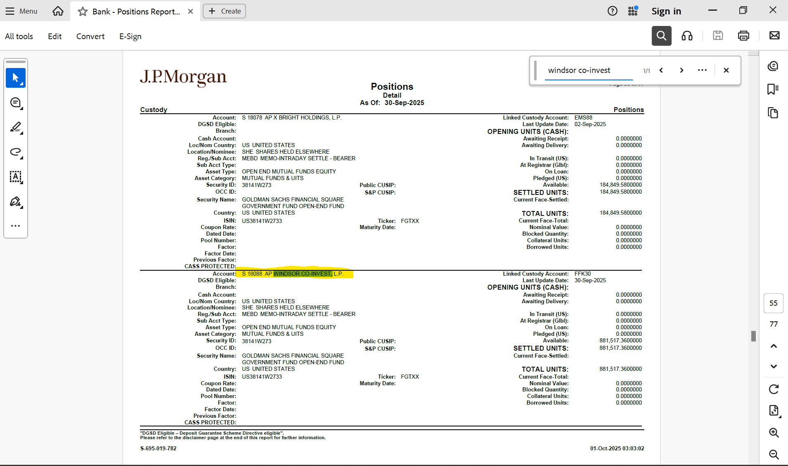
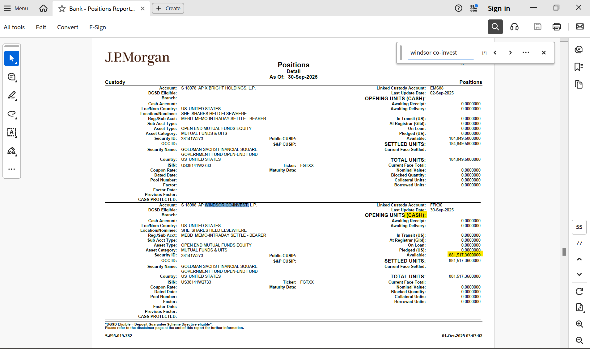
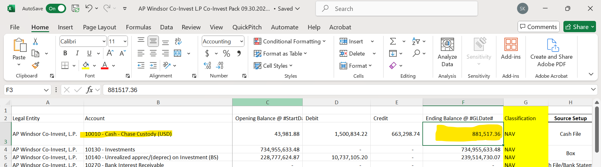
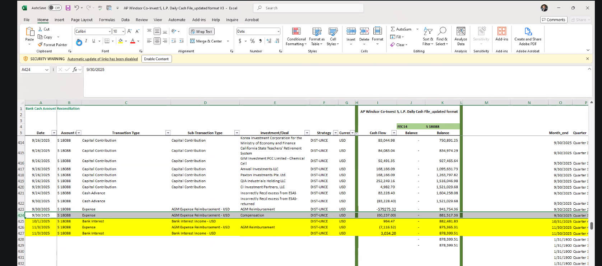

**NAV Pack Review- 10010-Cash-Custody (USD)- Business Process (current
process, workflow & logic) v1**

Dt.- 12/10/25

1.  **Overview**

- Accounting entry (Trial Balance) - 10010 - Cash - Chase Custody (USD)

- Data Source – Position Report (pdf) downloaded from bank portal

<u>Note:</u>

1)  Some coinvest funds may have multiple bank accounts requiring
    statement to be downloaded from more than one bank portal

2)  IVP Recon to house the bank transaction data & will eventually
    replace the current workflow. IVP Recon to go-live by Feb’26

- Sample NAV Pack – [AP Windsor Co-Invest L.P Co-Invest Pack
  09.30.2025.xlsm \| Powered by
  Box](https://apollo.app.box.com/file/2028622638453?s=nprl29y7f4fy8vrp2hh425ylq71hh150)

- Sample position report - [Bank - Positions Report - 2025.09.30.pdf \|
  Powered by
  Box](https://apollo.app.box.com/file/2037195808614?s=1qghqocaai5e64315whmltbf9z5029nx)

2.  **NAV Pack Review Workflow**

<!-- -->

1)  Login to the bank portal (JP Mogan bank in this case) & download the
    position report for the required quarter.

2)  Open the position report & search for the required fund (AP Windsor
    Co-invest in this case)-

3)  Look for the available cash balance in the statement –

4)  Match the cash balance found in bank statement with the ending
    balance found in NAV Pack –

5)  In the above example the cash balance is matching between position
    report & NAV Pack and hence no further action is required. In case
    of mismatch, Controller needs to analyze the transaction report to
    find out the reason for discrepancy & book the remediating entries
    in Investran.

<!-- -->

3.  **Remediation Workflow –**

<!-- -->

1)  In case of any difference between the Trial Balance value & cash
    balance present in bank report, Controllers need to analyze the root
    cause for the break and book the entry in Investran to rectify the
    break.

2)  Currently, Controllers rely on daily cash file excel to easily
    identify the break. Daily cash file is manually created by
    Controllers by going to the bank portal, downloading the transaction
    report for the day & copy pasting the transaction details from
    transaction report to the daily cash file.

3)  For sample cash file refer the “cash transaction” sheet within the
    NAV Pack ([AP Windsor Co-Invest L.P Co-Invest Pack 09.30.2025.xlsm
    \| Powered by
    Box](https://apollo.app.box.com/file/2028622638453?s=nprl29y7f4fy8vrp2hh425ylq71hh150)).
    Note the sheet is not a part of the NAV pack & has added afterwards
    by Business SME to provide daily cash file sample in single
    location.

4)  The daily cash file is part of the BAU activity to book the
    transaction in Investran & keep the track of same. Refer below
    screenshot for the daily cash file – it gives a day wise view all
    the transaction taken place in the bank account –

**In case of any breaks, the controller will compare the transaction
entries present within the transaction report to the entries present in
daily cash file identify the missing entries. In the above example
suppose there is a break of 60,237 (refer row 424 in above screenshot),
then Controller will see that the entry of 60,237 for expense in
transaction report but the same entry will not be present in cash file
and Controller will proceed ahead to book the transaction of 60,237 for
expense in Investran.**

5)  NOTE: In few cases there may be a valid break – Eg., expense of 5000
    has been paid off on 9/30 after the cut-off time then Investran will
    reflect balance including the 5000 expense however the bank
    statement for 9/30 will not reflect this entry since transaction was
    done past cut-off time and would reflect in bank statement for the
    next day 10/1. This is a valid break & no further action is
    required.

6)  Exception case: In rare scenario, Bank Statement may show an
    incorrect entry which the Controller is not aware of in which case
    Controllers reach out to Bank to check for the source/reason for the
    transaction & if it is incorrect then the controller requests the
    Bank to rectify the statement & reverse the transaction entry.

7)  Sample Transaction Statement - [All Transaction Activity -
    Windsor.pdf \| Powered by
    Box](https://apollo.app.box.com/file/2038310968375)

**NOTE: IVP Recon may replace the BAU process of preparing daily cash
file to reconcile & post cash entries on daily basis.**
