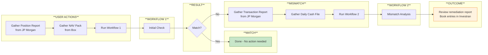

# Cash Custody Axon Workflow Diagrams (v2)

## Overview: Two Independent Workflows

The cash custody reconciliation is split into **two independently invokable workflows**:

| Workflow | Purpose | When to Run |
|----------|---------|-------------|
| **Workflow 1: Initial Check** | Extract balances, compare, detect mismatch | Every quarter for each fund |
| **Workflow 2: Mismatch Analysis** | Investigate break, identify root cause, recommend remediation | Only when Workflow 1 reports a mismatch |

This design:
- Eliminates mid-workflow human input (not supported in Axon)
- Allows independent testing of each workflow
- Enables direct invocation of Workflow 2 if user already knows there's a mismatch

---

## Workflow 1: Initial Check (Matching)

```mermaid
flowchart LR
    subgraph INPUTS1["**INPUTS**"]
        direction TB
        I1[/"position_report<br/>(File - PDF)"/]
        I2[/"nav_pack<br/>(File - Excel)"/]
        I3[/"fund_name<br/>(String)"/]
        I4[/"quarter_end_date<br/>(String)"/]
    end

    subgraph WF1["**WORKFLOW 1: INITIAL CHECK (MATCHING)**"]
        direction TB
        START1([Workflow Start]) --> TEAM1

        subgraph T1["Team: Position Report Extraction"]
            TEAM1[["speaker_selector<br/>document_reader<br/>data_extractor<br/>validator"]]
        end

        TEAM1 --> TEAM2

        subgraph T2["Team: NAV Pack Extraction"]
            TEAM2[["speaker_selector<br/>excel_reader<br/>data_extractor<br/>validator"]]
        end

        TEAM2 --> DEL1

        subgraph D1["Delegate: Balance Comparison"]
            DEL1["Compare balances<br/>Calculate variance"]
        end

        DEL1 --> DEL2

        subgraph D2["Delegate: Generate Result"]
            DEL2["Generate result report<br/>with match status"]
        end

        DEL2 --> DECISION{{"is_matched?"}}

        DECISION -->|"Yes"| END_MATCH([MATCH])
        DECISION -->|"No"| END_MISMATCH([MISMATCH])
    end

    subgraph OUTPUTS1["**OUTPUTS**"]
        direction TB
        O1[/"reconciliation_status<br/>(String)"/]
        O2[/"is_matched<br/>(Boolean)"/]
        O3[/"variance_amount<br/>(Float)"/]
        O4[/"bank_cash_balance<br/>(Float)"/]
        O5[/"nav_pack_balance<br/>(Float)"/]
        O6[/"initial_check_report<br/>(File)"/]
    end

    INPUTS1 --> START1
    END_MATCH --> OUTPUTS1
    END_MISMATCH --> OUTPUTS1

    classDef inputVar fill:#e3f2fd,stroke:#1565c0,stroke-width:1px
    classDef teamStep fill:#e8f5e9,stroke:#2e7d32,stroke-width:2px
    classDef delegateStep fill:#fce4ec,stroke:#c2185b,stroke-width:2px
    classDef decision fill:#f3e5f5,stroke:#7b1fa2,stroke-width:2px
    classDef endpointMatch fill:#c8e6c9,stroke:#2e7d32,stroke-width:2px
    classDef endpointMismatch fill:#ffcdd2,stroke:#c62828,stroke-width:2px

    class I1,I2,I3,I4,O1,O2,O3,O4,O5,O6 inputVar
    class TEAM1,TEAM2 teamStep
    class DEL1,DEL2 delegateStep
    class DECISION decision
    class END_MATCH endpointMatch
    class END_MISMATCH endpointMismatch
```

---

## Workflow 1: Detailed View (Double-Click)

```mermaid
flowchart LR
    START([Start])

    subgraph TEAM1_DETAIL["**TEAM: Position Report Extraction**"]
        direction LR
        subgraph T1_DR["document_reader"]
            T1_DR_1["read_input(position_report)"] --> T1_DR_2["Parse PDF"] --> T1_DR_3["Extract text"]
        end
        subgraph T1_DE["data_extractor"]
            T1_DE_1["Search fund_name"] --> T1_DE_2["Find 'Available' field"] --> T1_DE_3["Extract value + date"]
        end
        subgraph T1_V["validator"]
            T1_V_1{"Valid?"}
            T1_V_1 -->|Yes| T1_V_2["save_variable:<br/>bank_cash_balance"]
            T1_V_1 -->|No| T1_V_RETRY["Retry"]
        end
        T1_DR --> T1_DE --> T1_V
    end

    subgraph TEAM2_DETAIL["**TEAM: NAV Pack Extraction**"]
        direction LR
        subgraph T2_ER["excel_reader"]
            T2_ER_1["read_input(nav_pack)"] --> T2_ER_2["Find TB sheet"] --> T2_ER_3["Read contents"]
        end
        subgraph T2_DE["data_extractor"]
            T2_DE_1["Search '10010'"] --> T2_DE_2["Find Ending Balance col"] --> T2_DE_3["Extract value"]
        end
        subgraph T2_V["validator"]
            T2_V_1{"Valid?"}
            T2_V_1 -->|Yes| T2_V_2["save_variable:<br/>nav_pack_balance"]
            T2_V_1 -->|No| T2_V_RETRY["Retry"]
        end
        T2_ER --> T2_DE --> T2_V
    end

    subgraph DEL1_DETAIL["**DELEGATE: Balance Comparison**"]
        direction LR
        DEL1_IN["bank_cash_balance<br/>nav_pack_balance"] --> DEL1_CALC["variance =<br/>bank - nav_pack"]
        DEL1_CALC --> DEL1_CHECK{"< 0.01?"}
        DEL1_CHECK -->|Yes| DEL1_MATCH["is_matched = True"]
        DEL1_CHECK -->|No| DEL1_NOMATCH["is_matched = False"]
        DEL1_MATCH --> DEL1_SAVE["save_variable()"]
        DEL1_NOMATCH --> DEL1_SAVE
    end

    subgraph DEL2_DETAIL["**DELEGATE: Generate Result**"]
        direction LR
        DEL2_IN["is_matched<br/>variance_amount"] --> DEL2_CHECK{"matched?"}
        DEL2_CHECK -->|Yes| DEL2_MSG_MATCH["MATCH"]
        DEL2_CHECK -->|No| DEL2_MSG_NOMATCH["MISMATCH"]
        DEL2_MSG_MATCH --> DEL2_REPORT["Generate report"]
        DEL2_MSG_NOMATCH --> DEL2_REPORT
        DEL2_REPORT --> DEL2_SAVE["save_variable()"]
    end

    START --> TEAM1_DETAIL
    T1_V_2 --> TEAM2_DETAIL
    T2_V_2 --> DEL1_DETAIL
    DEL1_SAVE --> DEL2_DETAIL
    DEL2_SAVE --> END_WF1([Complete])

    classDef teamBox fill:#e8f5e9,stroke:#2e7d32,stroke-width:2px
    classDef delegateBox fill:#fce4ec,stroke:#c2185b,stroke-width:2px
    classDef agentBox fill:#fff8e1,stroke:#f57f17,stroke-width:1px

    class TEAM1_DETAIL,TEAM2_DETAIL teamBox
    class DEL1_DETAIL,DEL2_DETAIL delegateBox
    class T1_DR,T1_DE,T1_V,T2_ER,T2_DE,T2_V agentBox
```

---

## Workflow 2: Mismatch Analysis

```mermaid
flowchart LR
    subgraph INPUTS2["**INPUTS**"]
        direction TB
        I2_1[/"transaction_report<br/>(File - PDF)"/]
        I2_2[/"daily_cash_file<br/>(File - Excel)"/]
        I2_3[/"variance_amount<br/>(Float)"/]
        I2_4[/"fund_name<br/>(String)"/]
        I2_5[/"quarter_end_date<br/>(String)"/]
    end

    subgraph WF2["**WORKFLOW 2: MISMATCH ANALYSIS**"]
        direction TB
        START2([Workflow Start]) --> TEAM3

        subgraph T3["Team: Transaction Analysis"]
            TEAM3[["speaker_selector<br/>transaction_parser<br/>cash_file_parser<br/>reconciliation_analyst<br/>root_cause_analyst"]]
        end

        TEAM3 --> DEL3

        subgraph D3["Delegate: Generate Analysis Report"]
            DEL3["Compile findings<br/>Format remediation report"]
        end

        DEL3 --> END_ANALYSIS([Analysis Complete])
    end

    subgraph OUTPUTS2["**OUTPUTS**"]
        direction TB
        O2_1[/"root_cause_summary<br/>(String)"/]
        O2_2[/"missing_entries<br/>(String - JSON)"/]
        O2_3[/"is_valid_break<br/>(Boolean)"/]
        O2_4[/"remediation_entries<br/>(String - JSON)"/]
        O2_5[/"analysis_report<br/>(File)"/]
    end

    INPUTS2 --> START2
    END_ANALYSIS --> OUTPUTS2

    classDef inputVar fill:#e3f2fd,stroke:#1565c0,stroke-width:1px
    classDef teamStep fill:#e8f5e9,stroke:#2e7d32,stroke-width:2px
    classDef delegateStep fill:#fce4ec,stroke:#c2185b,stroke-width:2px
    classDef endpoint fill:#eceff1,stroke:#455a64,stroke-width:2px

    class I2_1,I2_2,I2_3,I2_4,I2_5,O2_1,O2_2,O2_3,O2_4,O2_5 inputVar
    class TEAM3 teamStep
    class DEL3 delegateStep
    class START2,END_ANALYSIS endpoint
```

---

## Workflow 2: Detailed View (Double-Click)

```mermaid
flowchart LR
    START2([Start])

    subgraph TEAM3_DETAIL["**TEAM: Transaction Analysis**"]
        direction LR

        subgraph T3_TP["transaction_parser"]
            T3_TP_1["read_input(transaction_report)"] --> T3_TP_2["Parse PDF table"] --> T3_TP_3["Create transactions_list[]"]
        end

        subgraph T3_CFP["cash_file_parser"]
            T3_CFP_1["read_input(daily_cash_file)"] --> T3_CFP_2["Parse Excel"] --> T3_CFP_3["Create cash_entries_list[]"]
        end

        subgraph T3_RA["reconciliation_analyst"]
            T3_RA_1["For each bank txn:"] --> T3_RA_2{"Match in<br/>cash file?"}
            T3_RA_2 -->|Yes| T3_RA_3["Mark MATCHED"]
            T3_RA_2 -->|No| T3_RA_4["Add to missing_entries[]"]
            T3_RA_3 --> T3_RA_5["Sum unmatched"]
            T3_RA_4 --> T3_RA_5
            T3_RA_5 --> T3_RA_6{"= variance?"}
        end

        subgraph T3_RCA["root_cause_analyst"]
            T3_RCA_1["For each missing:"] --> T3_RCA_2{"After cut-off?"}
            T3_RCA_2 -->|Yes| T3_RCA_3["TIMING<br/>valid_break=True"]
            T3_RCA_2 -->|No| T3_RCA_4["MISSING_ENTRY<br/>valid_break=False"]
            T3_RCA_3 --> T3_RCA_5["Determine txn type"]
            T3_RCA_4 --> T3_RCA_5
            T3_RCA_5 --> T3_RCA_6["Create remediation_entry"]
            T3_RCA_6 --> T3_RCA_7["save_variable()"]
        end

        T3_TP --> T3_RA
        T3_CFP --> T3_RA
        T3_RA_6 --> T3_RCA
    end

    subgraph DEL3_DETAIL["**DELEGATE: Generate Analysis Report**"]
        direction LR
        DEL3_IN["root_cause_summary<br/>missing_entries<br/>remediation_entries"] --> DEL3_B1["1. Header"]
        DEL3_B1 --> DEL3_B2["2. Root Cause Summary"]
        DEL3_B2 --> DEL3_B3["3. Missing Entries Table"]
        DEL3_B3 --> DEL3_B4["4. Valid Break Flag"]
        DEL3_B4 --> DEL3_B5["5. Remediation Recommendations"]
        DEL3_B5 --> DEL3_FORMAT["Format as Markdown"]
        DEL3_FORMAT --> DEL3_SAVE["save_variable(analysis_report)"]
    end

    START2 --> TEAM3_DETAIL
    T3_RCA_7 --> DEL3_DETAIL
    DEL3_SAVE --> END_WF2([Complete])

    classDef teamBox fill:#e8f5e9,stroke:#2e7d32,stroke-width:2px
    classDef delegateBox fill:#fce4ec,stroke:#c2185b,stroke-width:2px
    classDef agentBox fill:#fff8e1,stroke:#f57f17,stroke-width:1px

    class TEAM3_DETAIL teamBox
    class DEL3_DETAIL delegateBox
    class T3_TP,T3_CFP,T3_RA,T3_RCA agentBox
```

---

## Combined User Journey

---

## Legend

| Shape | Meaning |
|-------|---------|
| Parallelogram | Input/Output Variables |
| Double-bordered Rectangle | Agentic Team |
| Rectangle | Delegate (Deterministic Code) |
| Diamond | Decision Point |
| Stadium (green) | Successful End (Match) |
| Stadium (red) | Mismatch End (Requires Workflow 2) |

---

## Workflow 1: Step Details

| Step | Name | Type | Purpose |
|------|------|------|---------|
| 1 | Position Report Extraction | **Team** | Parse PDF, extract cash balance for fund |
| 2 | NAV Pack Extraction | **Team** | Parse Excel, extract TB balance for account 10010 |
| 3 | Balance Comparison | **Delegate** | Compare values, calculate variance |
| 4 | Generate Result | **Delegate** | Create status report with match/mismatch result |

## Workflow 2: Step Details

| Step | Name | Type | Purpose |
|------|------|------|---------|
| 1 | Transaction Analysis | **Team** | Parse both files, compare entries, identify root cause |
| 2 | Generate Analysis Report | **Delegate** | Compile findings into remediation report |

---

## Variable Summary

### Workflow 1: Initial Check

| Variable | Type | Direction | Description |
|----------|------|-----------|-------------|
| `position_report` | File | Input | Bank position report PDF |
| `nav_pack` | File | Input | NAV Pack Excel workbook |
| `fund_name` | String | Input | Fund to reconcile |
| `quarter_end_date` | String | Input | Quarter end date |
| `reconciliation_status` | String | Output | Human-readable status message |
| `is_matched` | Boolean | Output | True if balances match |
| `variance_amount` | Float | Output | Difference (bank - NAV Pack) |
| `bank_cash_balance` | Float | Output | Extracted bank balance |
| `nav_pack_balance` | Float | Output | Extracted NAV Pack balance |
| `initial_check_report` | File | Output | Summary report |

### Workflow 2: Mismatch Analysis

| Variable | Type | Direction | Description |
|----------|------|-----------|-------------|
| `transaction_report` | File | Input | Bank transaction report PDF |
| `daily_cash_file` | File | Input | Daily cash file Excel |
| `variance_amount` | Float | Input | Variance from Workflow 1 |
| `fund_name` | String | Input | Fund being analyzed |
| `quarter_end_date` | String | Input | Quarter end date |
| `root_cause_summary` | String | Output | Summary of break cause |
| `missing_entries` | String | Output | JSON list of unrecorded transactions |
| `is_valid_break` | Boolean | Output | True if timing difference |
| `remediation_entries` | String | Output | JSON list of recommended entries |
| `analysis_report` | File | Output | Comprehensive analysis report |
