# Cash Custody (USD) - Business Process Flowchart

## Account: 10010 - Cash - Chase Custody (USD)

```mermaid
flowchart TD
    subgraph INIT["**INITIALIZATION**"]
        START([Start: NAV Pack Review - Cash Custody]) --> LOGIN[Login to Bank Portal<br/>JP Morgan]
        LOGIN --> DOWNLOAD[Download Position Report<br/>for Required Quarter]
    end

    subgraph SEARCH["**FUND IDENTIFICATION**"]
        DOWNLOAD --> OPEN_REPORT[Open Position Report PDF]
        OPEN_REPORT --> SEARCH_FUND[Search for Required Fund<br/>e.g., AP Windsor Co-Invest]
        SEARCH_FUND --> MULTI_BANK{Fund has multiple<br/>bank accounts?}
        MULTI_BANK -->|Yes| REPEAT_DOWNLOAD[Download statements from<br/>additional bank portals]
        REPEAT_DOWNLOAD --> LOCATE_BALANCE
        MULTI_BANK -->|No| LOCATE_BALANCE[Locate Available Cash Balance<br/>in Position Report]
    end

    subgraph RECONCILE["**RECONCILIATION**"]
        LOCATE_BALANCE --> OPEN_NAV[Open NAV Pack Workbook]
        OPEN_NAV --> GET_TB[Get Trial Balance Ending Balance<br/>Account 10010 - Cash Custody USD]
        GET_TB --> COMPARE{Compare:<br/>Bank Balance vs<br/>NAV Pack Balance}
        COMPARE -->|Match| MATCH_END([Balance Matched<br/>No Action Required])
    end

    subgraph INVESTIGATE["**BREAK INVESTIGATION**"]
        COMPARE -->|Mismatch| BREAK_DETECTED[Break Detected:<br/>Record Variance Amount]
        BREAK_DETECTED --> GET_DAILY_CASH[Access Daily Cash File<br/>Excel Spreadsheet]
        GET_DAILY_CASH --> DOWNLOAD_TXN[Download Transaction Report<br/>from Bank Portal]
        DOWNLOAD_TXN --> COMPARE_TXN[Compare Transaction Entries:<br/>Bank Report vs Daily Cash File]
        COMPARE_TXN --> IDENTIFY_MISSING[Identify Missing/<br/>Unrecorded Entries]
    end

    subgraph ANALYSIS["**ROOT CAUSE ANALYSIS**"]
        IDENTIFY_MISSING --> ANALYZE_CAUSE{Determine<br/>Break Cause}
        ANALYZE_CAUSE -->|Missing Entry in Investran| MISSING_ENTRY[Entry exists in bank<br/>but not in daily cash file]
        ANALYZE_CAUSE -->|Timing Difference| TIMING_CHECK{Transaction after<br/>cut-off time?}
        ANALYZE_CAUSE -->|Unknown Bank Entry| UNKNOWN_ENTRY[Unrecognized entry<br/>in bank statement]
    end

    subgraph TIMING["**TIMING VALIDATION**"]
        TIMING_CHECK -->|Yes| VALID_BREAK[Valid Break:<br/>Transaction will appear<br/>in next day statement]
        VALID_BREAK --> DOCUMENT_TIMING[Document as Valid<br/>Timing Difference]
        DOCUMENT_TIMING --> TIMING_END([No Action Required<br/>Valid Break])
        TIMING_CHECK -->|No| MISSING_ENTRY
    end

    subgraph BANK_EXCEPTION["**BANK EXCEPTION HANDLING**"]
        UNKNOWN_ENTRY --> CONTACT_BANK[Contact Bank to<br/>Verify Transaction Source]
        CONTACT_BANK --> BANK_RESPONSE{Bank confirms<br/>entry is incorrect?}
        BANK_RESPONSE -->|Yes| REQUEST_REVERSAL[Request Bank to:<br/>1. Rectify Statement<br/>2. Reverse Transaction]
        REQUEST_REVERSAL --> AWAIT_CORRECTION[Await Bank Correction]
        AWAIT_CORRECTION --> REDOWNLOAD[Re-download Corrected<br/>Position Report]
        REDOWNLOAD --> COMPARE
        BANK_RESPONSE -->|No - Entry is Valid| MISSING_ENTRY
    end

    subgraph REMEDIATION["**REMEDIATION IN INVESTRAN**"]
        MISSING_ENTRY --> PREPARE_ENTRY[Prepare Journal Entry<br/>for Investran]
        PREPARE_ENTRY --> DETERMINE_TYPE[Determine Transaction Type:<br/>- Capital Contribution<br/>- Cash Advance<br/>- Expense<br/>- Bank Interest<br/>- AGM Reimbursement]
        DETERMINE_TYPE --> BOOK_ENTRY[Book Remediation Entry<br/>in Investran]
        BOOK_ENTRY --> UPDATE_CASH_FILE[Update Daily Cash File<br/>with New Entry]
        UPDATE_CASH_FILE --> VERIFY_BALANCE{Re-verify:<br/>Balance now matches?}
        VERIFY_BALANCE -->|No| COMPARE_TXN
        VERIFY_BALANCE -->|Yes| REMEDIATION_END([Remediation Complete<br/>Balance Reconciled])
    end

    subgraph DAILY_BAU["**DAILY BAU PROCESS**"]
        direction TB
        BAU_START([Daily Cash File Maintenance]) --> BAU_LOGIN[Login to Bank Portal]
        BAU_LOGIN --> BAU_DOWNLOAD[Download Daily<br/>Transaction Report]
        BAU_DOWNLOAD --> BAU_COPY[Copy/Paste Transaction<br/>Details to Daily Cash File]
        BAU_COPY --> BAU_BOOK[Book Transactions<br/>in Investran]
        BAU_BOOK --> BAU_END([Daily BAU Complete])
    end

    %% Styling
    classDef startEnd fill:#e1f5fe,stroke:#01579b,stroke-width:2px
    classDef process fill:#fff3e0,stroke:#e65100,stroke-width:1px
    classDef decision fill:#fce4ec,stroke:#880e4f,stroke-width:1px
    classDef success fill:#e8f5e9,stroke:#2e7d32,stroke-width:2px
    classDef warning fill:#fff8e1,stroke:#f57f17,stroke-width:1px
    classDef error fill:#ffebee,stroke:#c62828,stroke-width:1px

    class START,MATCH_END,TIMING_END,REMEDIATION_END,BAU_START,BAU_END startEnd
    class LOGIN,DOWNLOAD,OPEN_REPORT,SEARCH_FUND,LOCATE_BALANCE,OPEN_NAV,GET_TB,BREAK_DETECTED,GET_DAILY_CASH,DOWNLOAD_TXN,COMPARE_TXN,IDENTIFY_MISSING,MISSING_ENTRY,CONTACT_BANK,PREPARE_ENTRY,DETERMINE_TYPE,BOOK_ENTRY,UPDATE_CASH_FILE,REPEAT_DOWNLOAD,REQUEST_REVERSAL,AWAIT_CORRECTION,REDOWNLOAD,BAU_LOGIN,BAU_DOWNLOAD,BAU_COPY,BAU_BOOK process
    class COMPARE,MULTI_BANK,ANALYZE_CAUSE,TIMING_CHECK,BANK_RESPONSE,VERIFY_BALANCE decision
    class VALID_BREAK,DOCUMENT_TIMING warning
    class UNKNOWN_ENTRY error
```

---

## Missing Information / Open Questions

> **NOTE:** The following areas have incomplete or missing information in the source documentation that may need clarification:

### 1. Access & Authentication
- [ ] **Bank Portal Credentials:** How are login credentials managed for JP Morgan portal? Is there SSO or separate credentials?
- [ ] **Access Control:** Who has access to download position reports? Is there role-based access?

### 2. Process Timing & Thresholds
- [ ] **Cut-off Time:** What is the exact daily cut-off time for transactions that determines valid timing breaks?
- [ ] **Tolerance Threshold:** Is there a materiality threshold for breaks (e.g., ignore differences < $100)?
- [ ] **Frequency:** How often is the NAV Pack review performed - quarterly only or also monthly?

### 3. Multi-Bank Account Handling
- [ ] **Bank List:** What other banks besides JP Morgan are used for co-invest funds?
- [ ] **Consolidation:** How are balances from multiple bank accounts consolidated in the NAV Pack?
- [ ] **Account Mapping:** How are multiple bank accounts mapped to a single 10010 GL account?

### 4. Daily Cash File Details
- [ ] **File Location:** Where is the daily cash file stored? Local drive, shared network, or cloud?
- [ ] **File Structure:** What are all the required columns/fields in the daily cash file?
- [ ] **Ownership:** Who is responsible for maintaining the daily cash file?

### 5. Investran Booking Process
- [ ] **Entry Types:** What are all valid transaction types beyond those shown (Capital Contribution, Cash Advance, Expense, Bank Interest, AGM Reimbursement)?
- [ ] **Approval Workflow:** Is there a maker-checker or approval process for booking entries?
- [ ] **GL Mapping:** What are the contra accounts used for each transaction type?

### 6. Exception Handling
- [ ] **Escalation Path:** What is the escalation process if a break cannot be resolved?
- [ ] **Bank Contact:** Who at the bank should be contacted for incorrect entries? What is the SLA?
- [ ] **Documentation Requirements:** How should breaks and resolutions be documented for audit?

### 7. IVP Recon Integration (Future State - Feb 2026)
- [ ] **Scope:** Which parts of the current workflow will IVP Recon replace?
- [ ] **Data Flow:** How will bank transaction data flow into IVP Recon?
- [ ] **Transition Plan:** Will there be a parallel run period?

### 8. Controls & Compliance
- [ ] **Segregation of Duties:** Are there SOD controls between who downloads statements and who books entries?
- [ ] **Review/Sign-off:** Is there a review step before finalizing the reconciliation?
- [ ] **Retention:** How long are position reports and daily cash files retained?

---

## Key Systems Referenced

| System | Purpose |
|--------|---------|
| JP Morgan Bank Portal | Download position reports and transaction reports |
| NAV Pack (Excel) | Contains Trial Balance with ending balances |
| Daily Cash File (Excel) | Manual tracking of daily bank transactions |
| Investran | Accounting system for booking journal entries |
| IVP Recon | Future replacement for daily cash reconciliation (Feb 2026) |

---

## Transaction Types Identified

From the daily cash file screenshot (image4):
- Capital Contribution
- Cash Advance
- Expense (AGM Expense Reimbursement)
- Bank Interest
- Compensation

---

*Document generated from: 10010-Cash-Custody (USD)- Business Process.md*
*Source date: 12/10/25*
